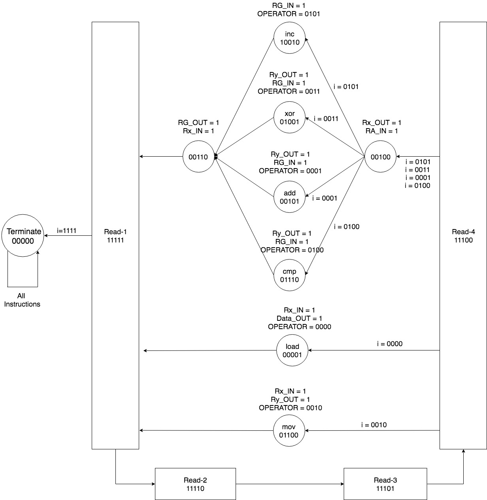

# Simulated-CPU-Processor
This is the simulated CPU processor implementation using VHDL and can be loaded to the FPGA board.
It implementing the functionalities of a processor. The instructions stored in RAM are 16 bits, the data of load instruction takes up full 16 bits. 

## General FSM graph representation

 

## Datapath for the whole processor

 

### Detail operation table and ALU structure

 
